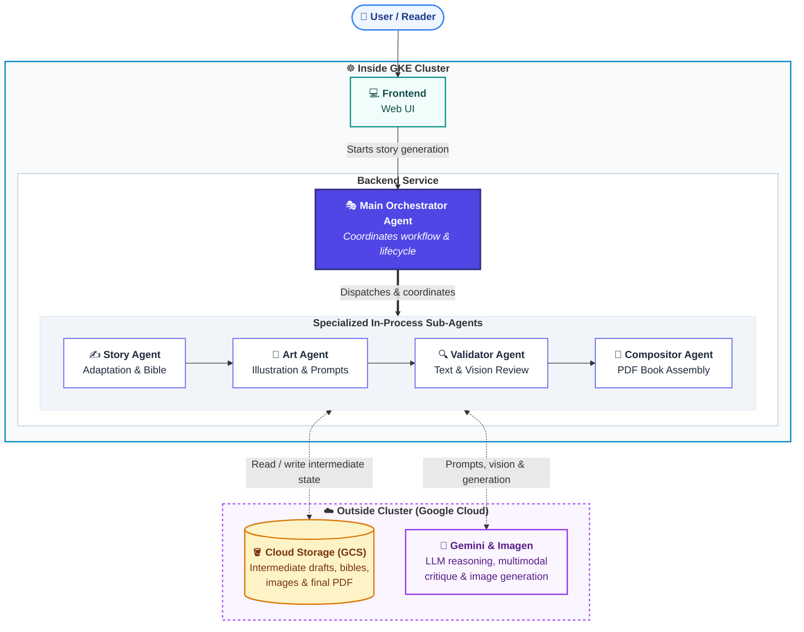

# Storybook Agent

A multi-agent pipeline that adapts public-domain literature into illustrated children's storybooks, built on Google ADK and Vertex AI (Gemini + Imagen), deployable on GKE or Cloud Run.

## Project Structure

```
.
├── docs/
│   ├── architecture/       # Architecture diagrams and design docs
│   └── runbooks/           # Operational runbooks
├── src/
│   ├── agents/             # ADK agent definitions
│   ├── tools/              # Shared tool implementations
│   └── api/                # FastAPI service layer
├── k8s/                    # Kubernetes manifests
├── infra/
│   └── terraform/          # GCP infrastructure as code
└── scripts/                # Dev and operational scripts
```

## Architecture



See [docs/architecture/architecture.md](docs/architecture/architecture.md) for the detailed pipeline diagrams and design notes.

## Quick Start

_Coming soon._

## Tech Stack

- **Agents**: [Google ADK](https://google.github.io/adk-docs/) (Python)
- **LLM**: Gemini 2.0 Flash / Pro via Vertex AI
- **Image generation**: Imagen 3 via Vertex AI
- **Storage**: Google Cloud Storage (session-scoped artifact folders)
- **Serving**: Cloud Run (MVP) / GKE (production)
