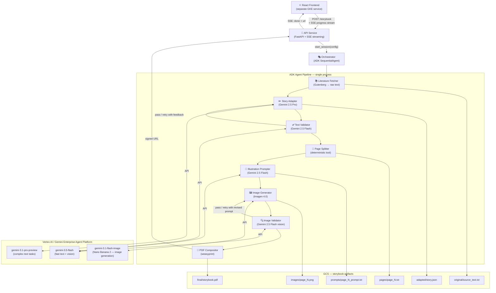
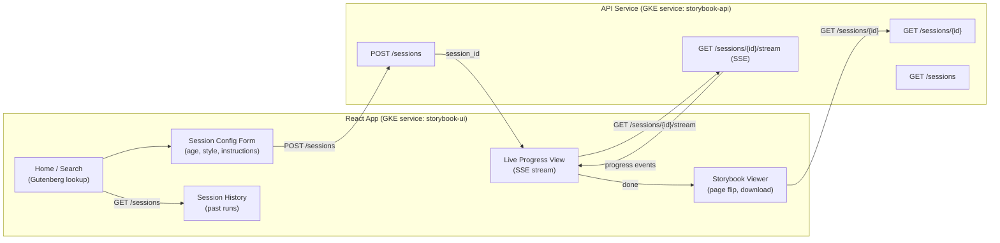
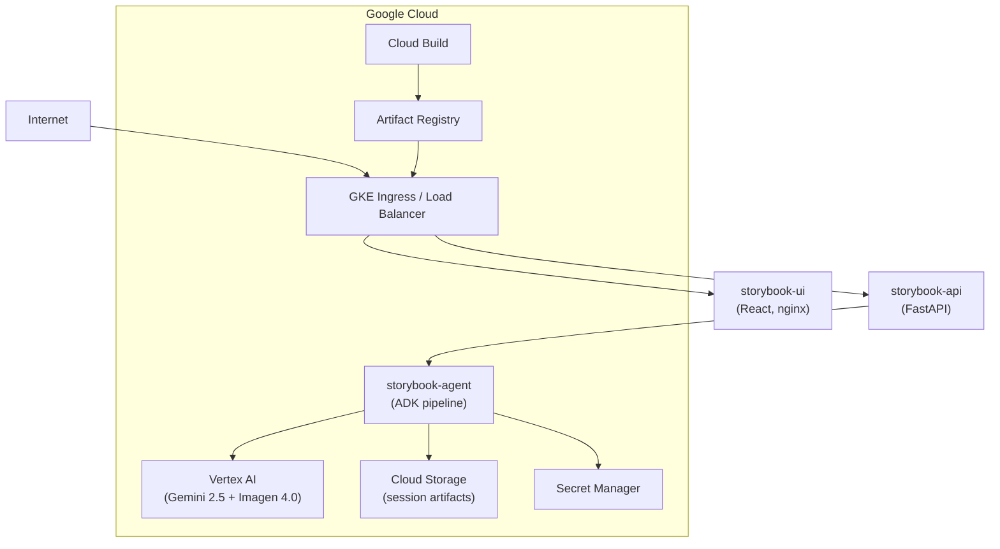
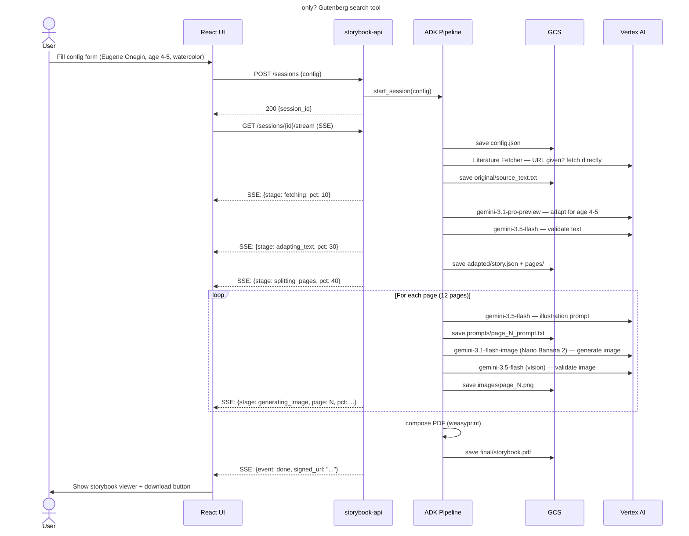

# Storybook Agent — Architecture

A multi-agent pipeline that adapts public-domain literature into illustrated children's storybooks, deployed on Google Cloud.

---

## System Overview

All agents run inside a **single ADK process** (one GKE pod / Cloud Run instance). ADK's `SequentialAgent` and `ParallelAgent` composability handles orchestration in-process — no inter-agent network hops. If the image generation step becomes a scaling bottleneck later, it can be extracted to a separate worker pool, but the pipeline is sequential so splitting now adds ops complexity with no benefit.



---

## Agent Responsibilities

| Agent | Role | Model |
|---|---|---|
| **Orchestrator** | Runs the full pipeline; holds session context; emits SSE progress events | ADK `SequentialAgent` |
| **Literature Fetcher** | Given a title/author or URL, uses Gutenberg search tool or fetches directly — agent decides which is more appropriate; strips boilerplate | HTTP tool + GCS |
| **Story Adapter** | Rewrites source text for the target age group; respects user's custom instructions | `gemini-3.1-pro-preview` |
| **Text Validator** | Checks adapted text: reading level, age-appropriateness, completeness; sends feedback to Adapter if retry needed | `gemini-3.5-flash` |
| **Page Splitter** | Segments adapted story into pages using word-count budget derived from age group | deterministic |
| **Illustration Prompter** | Writes a rich, style-consistent image prompt for each page; maintains character/world continuity | `gemini-3.5-flash` |
| **Image Generator** | Calls Nano Banana 2 to produce one illustration per page | `gemini-3.1-flash-image` (Nano Banana 2) |
| **Image Validator** | Uses Gemini vision to check each image: style consistency, content safety, match to page text; sends revised prompt back if needed | `gemini-3.5-flash` |
| **PDF Compositor** | Combines page text + images into a formatted PDF storybook | `weasyprint` |

---

## Session Input Schema

A session is started with a structured config. The user can provide as much or as little as they want — sensible defaults fill the rest.

```json
{
  "source": {
    "gutenberg_url": "https://www.gutenberg.org/ebooks/XXXX",
    "title": "Eugene Onegin",
    "author": "Alexander Pushkin"
  },
  "target_age": "4-5",
  "art_style": "watercolor",
  "page_count": 12,
  "custom_instructions": "Focus on the friendship themes. Use simple rhyming language.",
  "language": "en"
}
```

**Age group → pipeline parameters mapping:**

| Age Group | Max words/page | Sentence length | Gemini reading level target |
|---|---|---|---|
| 4–5 | 20 | 5–7 words | Pre-K / Primer |
| 6–8 | 50 | 8–12 words | Grade 1–2 |
| 9–12 | 100 | 12–20 words | Grade 3–5 |

---

## Frontend Architecture

A separate React service — not ADK's built-in debug UI.



**Tech choices for the frontend:**

| Concern | Choice |
|---|---|
| Framework | React 19 + TypeScript |
| Build tool | Vite |
| Styling | Tailwind CSS |
| Real-time progress | Server-Sent Events (SSE) — simpler than WebSockets for one-way server push |
| Page flip animation | `react-pageflip` |
| State management | Zustand (lightweight) |
| HTTP client | `@tanstack/react-query` |

**SSE progress event shape:**
```json
{ "event": "progress", "stage": "adapting_text", "pct": 30, "message": "Adapting prose for ages 4–5…" }
{ "event": "progress", "stage": "generating_image", "page": 3, "pct": 65 }
{ "event": "done", "signed_url": "https://storage.googleapis.com/...", "session_id": "abc123" }
{ "event": "error", "stage": "image_validation", "message": "Image retry limit exceeded on page 2" }
```

---

## Deployment Topology



Three GKE services:
- `storybook-ui` — React app served by nginx, scales to 0 off-hours
- `storybook-api` — FastAPI, receives requests and manages SSE streams
- `storybook-agent` — ADK process, one pod per in-flight session (or queue-based)

---

## GCS Artifact Layout

```
gs://storybook-artifacts-{project_id}/
└── sessions/
    └── {session_id}/
        ├── config.json              ← full session input
        ├── original/
        │   └── source_text.txt
        ├── adapted/
        │   └── story.json           ← title, author, adapted_text, metadata
        ├── pages/
        │   ├── page_01.txt
        │   └── page_N.txt
        ├── prompts/
        │   ├── page_01_prompt.txt
        │   └── page_N_prompt.txt
        ├── images/
        │   ├── page_01.png
        │   └── page_N.png
        └── final/
            └── storybook.pdf
```

---

## Technology Summary

| Concern | Choice | Notes |
|---|---|---|
| Agent framework | Google ADK (Python) | Single process, SequentialAgent + ParallelAgent |
| Complex text tasks | `gemini-3.1-pro-preview` | Story adaptation (highest capability) |
| Fast text + vision | `gemini-3.5-flash` | Validation, prompts, vision checks |
| Image generation | `gemini-3.1-flash-image` | Nano Banana 2 (latest fast image model); `gemini-3-pro-image` (Nano Banana Pro) for higher fidelity |
| Frontend | React 19 + Vite + Tailwind | Separate GKE service |
| Real-time updates | SSE | Server → client progress stream |
| Serving | GKE | Three services: ui, api, agent |
| Artifacts | GCS | Session-scoped folders, signed URLs for delivery |
| PDF generation | `weasyprint` | HTML/CSS → PDF, good typography |
| Source texts | Project Gutenberg | Free public-domain library |
| IaC | Terraform | `infra/terraform/` |

---

## Session Lifecycle



---

## Resolved Decisions

| Decision | Choice |
|---|---|
| Pod lifecycle | Single pod — personal project, one user |
| Gutenberg source | Agent decides: URL provided → direct fetch; title/author only → Gutenberg search tool |
| Auth | Anonymous — no login required |
| Image model | `gemini-3.1-flash-image` (Nano Banana 2); swap to `gemini-3-pro-image` (Nano Banana Pro) for higher fidelity |
| Text models | `gemini-3.1-pro-preview` for adaptation; `gemini-3.5-flash` for everything else |

## Open Questions

- [ ] **Retry policy**: Max retries for text/image validation before surfacing error to user?
- [ ] **Art style presets**: Curated list (watercolor, gouache, pencil sketch, flat vector, linocut) or free-form string?
