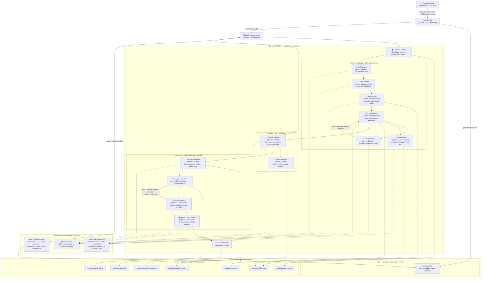
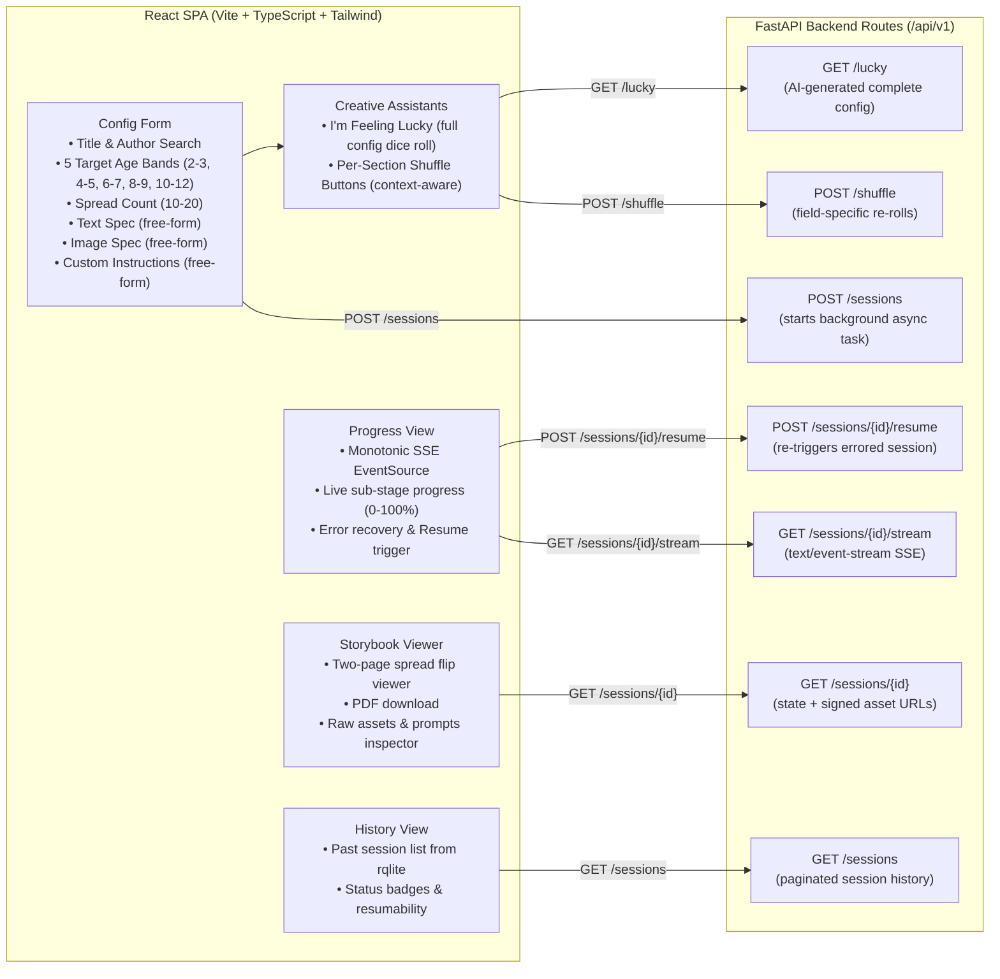
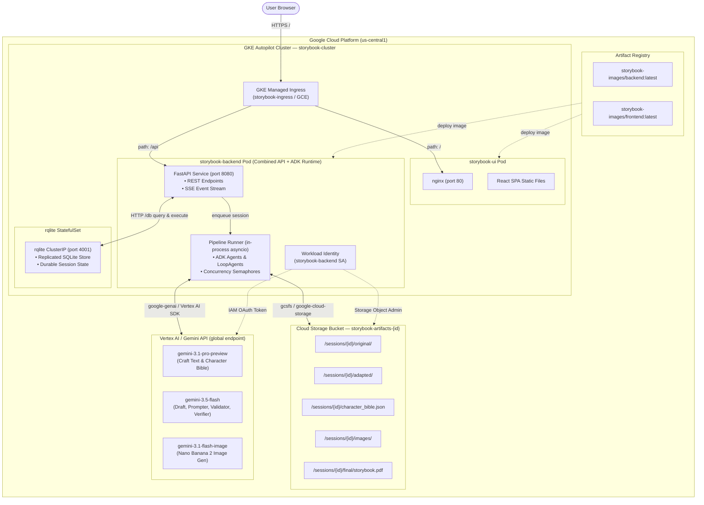
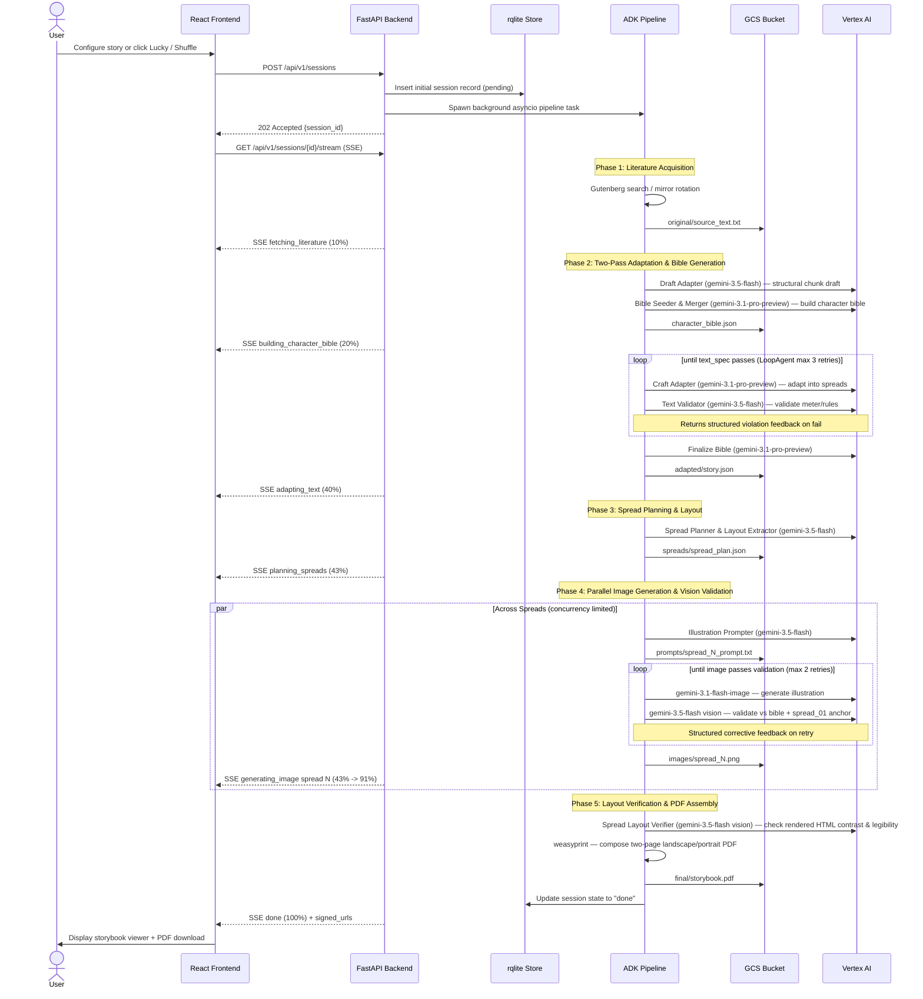

# Storybook Agent — Architecture

A multi-agent pipeline that adapts public-domain literature into illustrated children's storybooks, deployed on Google Cloud.

---

## System Overview

All agents run inside a **single backend process** (one GKE pod running FastAPI and the ADK execution runtime). ADK's `LlmAgent` and `LoopAgent` composability handles orchestration in-process with `asyncio` queues and concurrency semaphores — no inter-agent network hops.

The core design principle for custom constraints (poetry forms, art styles, character consistency) is:
> **Free-form natural language specs, injected into prompts, evaluated by the LLM.** No hardcoding of rules. Adding a new constraint requires zero code changes — the user just describes it.



---

## Frontend Architecture

The frontend is a lightweight **React 18 SPA** built with Vite, TypeScript, and Tailwind CSS. It communicates with the backend via REST and a persistent Server-Sent Events (SSE) connection.



### Key UI Features
- **5 Age Bands**: Granular targeting for `2-3`, `4-5`, `6-7`, `8-9`, and `10-12` with age-appropriate vocabulary, sentence length, and spread composition.
- **Creative Exploration**: "I'm Feeling Lucky" produces end-to-end creative seeds, while per-section **Shuffle buttons** regenerate title/author, text forms, illustration specs, or custom rules with prior fields as context.
- **Monotonic Live Progress**: The SSE stream delivers smooth sub-stage percentages across drafting (0–10%), bible creation (10–20%), craft adaptation (20–40%), layout planning (40–43%), parallel image generation (43–91%), and PDF compilation (91–100%).
- **Resilience & Resumption**: Errored runs can be resumed in-place via `POST /sessions/{id}/resume`, picking up from the last completed checkpoint.

---

## Agent Pipeline Details

The pipeline uses a **two-pass adaptation** approach to achieve literary quality and strong visual consistency.

```
Literature Fetcher
      │
      ▼
Draft Adapter (gemini-3.5-flash)  ─── Fast structural chunk draft
      │
      ▼
Character Bible Seeder & Merger (gemini-3.1-pro-preview)  ─── Character & visual world definition
      │
      ▼
Craft Adapter (gemini-3.1-pro-preview)  ─── LoopAgent with Text Validator
      │
      ▼
Finalize Bible (gemini-3.1-pro-preview)  ─── Synchronize bible with final craft text
      │
      ▼
Spread Planner & Layout Extractor (gemini-3.5-flash)  ─── Spreads, aspect ratios & typography
      │
      ▼
Illustration Prompter (gemini-3.5-flash)  ─── Injects character bible + art style + spread context
      │
      ▼
Image Generator (gemini-3.1-flash-image)  ─── Parallel generation (concurrency-limited)
      │
      ▼
Image Validator (gemini-3.5-flash vision)  ─── Multimodal check vs bible + style anchor
      │
      ▼
Spread Layout Verifier (gemini-3.5-flash vision)  ─── Multimodal legibility check on rendered HTML
      │
      ▼
PDF Compositor (weasyprint)  ─── Final print-ready PDF
```

### Agent Roster

| Agent | Role | Model | Validation / Feedback |
|---|---|---|---|
| **Literature Fetcher** | Fetches public-domain works via Gutenberg API, OPDS Atom catalog, or mirror rotation (`pglaf.org`, `aleph.gutenberg.org`) | Tool execution / deterministic | Validates non-empty text, strips headers |
| **Draft Adapter** | Fast structural draft of story text chunk | `gemini-3.5-flash` | Checks word counts and age-appropriate structure |
| **Character Bible Seeder & Merger** | Extracts character traits, attire, physical features, and setting rules; reconciles multi-chunk seeds | `gemini-3.1-pro-preview` | Structured JSON output conforming to bible schema |
| **Craft Adapter** | Adapts story into two-page spreads with verse/meter and literary craft rules | `gemini-3.1-pro-preview` *(Aspirational: `gemini-3.5-pro`)* | Paired with Text Validator in ADK `LoopAgent` |
| **Text Validator** | Evaluates adapted text against `text_spec` constraints (meter, rhyme, vocabulary, cadence) | `gemini-3.5-flash` | Returns structured pass/fail with exact violation notes |
| **Spread Planner & Layout Extractor** | Determines verso/recto content, illustration coverage (full, verso, recto), aspect ratio (16:9, 3:4, 1:1), and color themes | `gemini-3.5-flash` | Validates layout balance and page count constraints |
| **Illustration Prompter** | Crafts comprehensive image prompts embedding bible rules, scene cues, and art style | `gemini-3.5-flash` | Injects style anchors and character definitions |
| **Image Generator** | Generates high-resolution spread illustrations | `gemini-3.1-flash-image` (Nano Banana 2) *(Aspirational: `gemini-3-pro-image`)* | Handled with exponential backoff & content policy recovery |
| **Image Validator** | Multimodal evaluation against character bible, spread 0/1 style anchor, and previous spread | `gemini-3.5-flash` (vision) | Returns structured pass/fail with corrective prompt feedback |
| **Spread Layout Verifier** | Multimodal check of rendered HTML spread + image for typography contrast and legibility | `gemini-3.5-flash` (vision) | Checks text placement, overlay readability, and clipping |
| **PDF Compositor** | Assembles spreads into two-page landscape / portrait PDF with HTML/CSS styling | `weasyprint` + Jinja2 | Validates page geometry and font embedding |

---

## Deployment Topology

The application is deployed to **Google Kubernetes Engine (GKE) Autopilot** in `us-central1`.



---

## Session Lifecycle



---

## Resolved Decisions & Architecture Annotations

| Decision | Implemented Choice | Aspirational / Future State Annotation |
|---|---|---|
| **Pod Lifecycle** | Single `storybook-backend` pod running FastAPI + ADK pipeline execution via in-process `asyncio` tasks | Aspirational for multi-tenant scale: decoupled Celery / Cloud Tasks queue with independent autoscaling worker pods |
| **Gutenberg Source** | Gutenberg search (`gutendex`) with fallback to OPDS Atom catalog (`m.gutenberg.org`) and mirror rotation (`pglaf.org`, `aleph.gutenberg.org`) | Standalone local Gutenberg mirror cache on persistent disk |
| **Target Age Granularity** | 5 distinct age bands (`2-3`, `4-5`, `6-7`, `8-9`, `10-12`) with calibrated vocabulary and spread geometry | Custom reading-level lexile score tuning |
| **Creative Controls** | "I'm Feeling Lucky" full-form prompt generation + per-field context-aware Shuffle buttons | Community prompt gallery and fine-tuned style presets |
| **Image Model** | `gemini-3.1-flash-image` (Nano Banana 2) via `google-genai` Vertex AI SDK | Aspirational: `gemini-3-pro-image` (Nano Banana Pro) when broadly available for higher artistic fidelity |
| **Craft Text Model** | `gemini-3.1-pro-preview` for craft adaptation, bible seeding/merging/finalizing | Aspirational: `gemini-3.5-pro` when GA |
| **Fast Text & Vision** | `gemini-3.5-flash` for drafting, text validation, illustration prompts, image validation, and HTML page verification | Continuous upgrade to newest Flash checkpoints |
| **Layout & Spreads** | True two-page spread architecture (verso/recto) with dynamic aspect ratios (16:9, 3:4, 1:1) and layout verifier | Interactive in-browser visual spread designer |
| **Session Persistence** | **rqlite** replicated SQLite cluster on GKE for durable relational session state & history | Managed Cloud SQL (PostgreSQL) if enterprise multi-cluster scale is needed |
| **Object Storage** | Google Cloud Storage (`storybook-artifacts-{id}`) with session folder partitioning | Cloud CDN signed URL caching for high-traffic public reading |
| **PDF Engine** | `weasyprint` + Jinja2 HTML/CSS templates | Headless Chrome print-to-PDF pipeline for advanced CSS paged media support |
