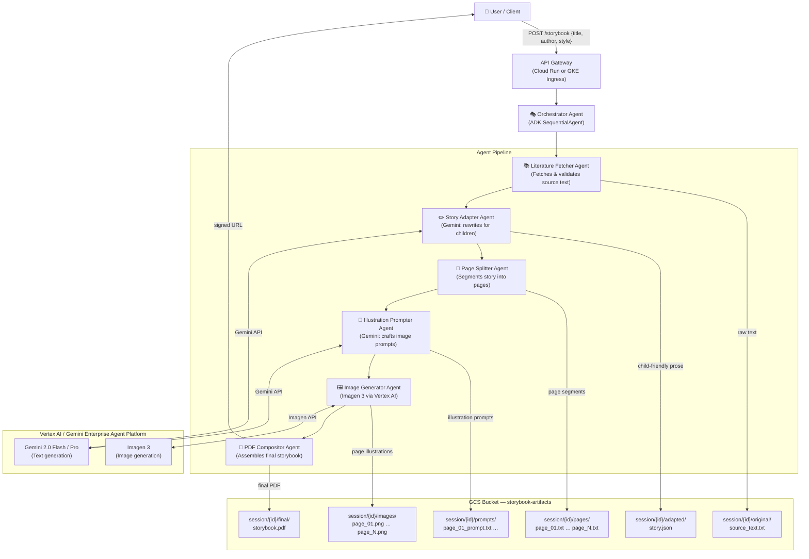
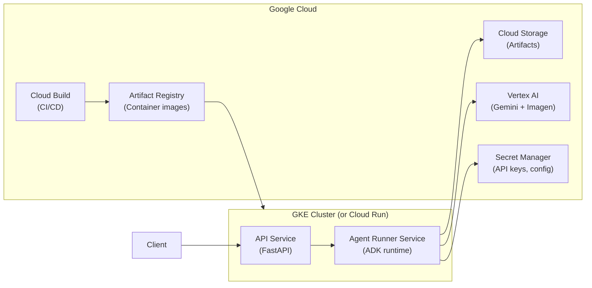
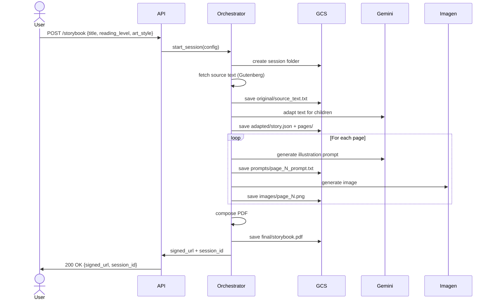

# Storybook Agent — Architecture

A multi-agent pipeline that adapts public-domain literature into illustrated children's storybooks, deployed on Google Cloud.

---

## System Overview



---

## Agent Responsibilities

| Agent | Role | Model / Tool |
|---|---|---|
| **Orchestrator** | Coordinates the full pipeline; passes session context between agents | ADK `SequentialAgent` |
| **Literature Fetcher** | Accepts a Project Gutenberg URL or title, downloads raw text, strips boilerplate | HTTP tool + GCS write |
| **Story Adapter** | Rewrites the source text as age-appropriate prose (target reading level configurable) | Gemini 2.0 Flash |
| **Page Splitter** | Segments the adapted story into discrete pages (word-count budget per page) | Deterministic tool |
| **Illustration Prompter** | Generates a rich image prompt for each page, consistent style/character descriptions | Gemini 2.0 Flash |
| **Image Generator** | Calls Imagen 3 to produce one illustration per page | Imagen 3 via Vertex AI |
| **PDF Compositor** | Combines page text + images into a formatted PDF storybook | Python (`reportlab` or `weasyprint`) |

---

## GCS Artifact Layout

```
gs://storybook-artifacts-{project_id}/
└── sessions/
    └── {session_id}/          # UUID generated per run
        ├── original/
        │   └── source_text.txt
        ├── adapted/
        │   └── story.json     # title, author, reading_level, full_text
        ├── pages/
        │   ├── page_01.txt
        │   └── page_N.txt
        ├── prompts/
        │   ├── page_01_prompt.txt
        │   └── page_N_prompt.txt
        ├── images/
        │   ├── page_01.png
        │   └── page_N.png
        └── final/
            └── storybook.pdf
```

---

## Deployment Topology



---

## Technology Choices

| Concern | Choice | Rationale |
|---|---|---|
| Agent framework | Google ADK (Python) | Native Vertex AI integration, supports multi-agent orchestration |
| LLM | Gemini 2.0 Flash / Pro | Cost-efficient for text; Pro for complex adaptation tasks |
| Image generation | Imagen 3 | Highest quality Google-native image model |
| Serving | Cloud Run (MVP) → GKE (scale) | Cloud Run for fast iteration; GKE for long-running pipelines |
| Artifact storage | GCS | Durable, session-scoped, easy signed URL generation |
| PDF generation | `weasyprint` (HTML→PDF) | CSS-based layout, good typography control |
| Source texts | Project Gutenberg API | Largest free public-domain library |

---

## Session Lifecycle



---

## Open Questions / Decisions Pending

- [ ] **Async vs sync API**: Long pipeline (~minutes) — use async job + polling endpoint, or streaming SSE?
- [ ] **Art style control**: Fixed styles (watercolor, cartoon, pencil sketch) or free-form prompt injection?
- [ ] **Reading level targeting**: Fixed tiers (ages 4–6, 7–9, 10–12) or Flesch-Kincaid scoring loop?
- [ ] **Multi-language**: English-only MVP or i18n from the start?
- [ ] **Source selection UI**: URL paste only, or a built-in Gutenberg search?
- [ ] **Page count**: Fixed (12 pages standard picture book) or derived from source length?
