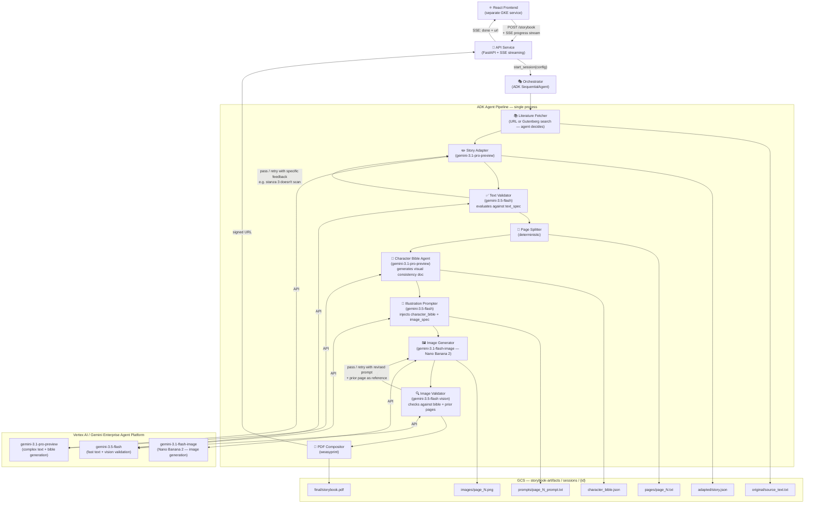
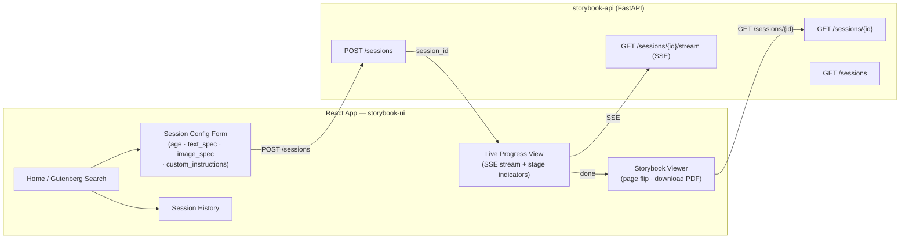
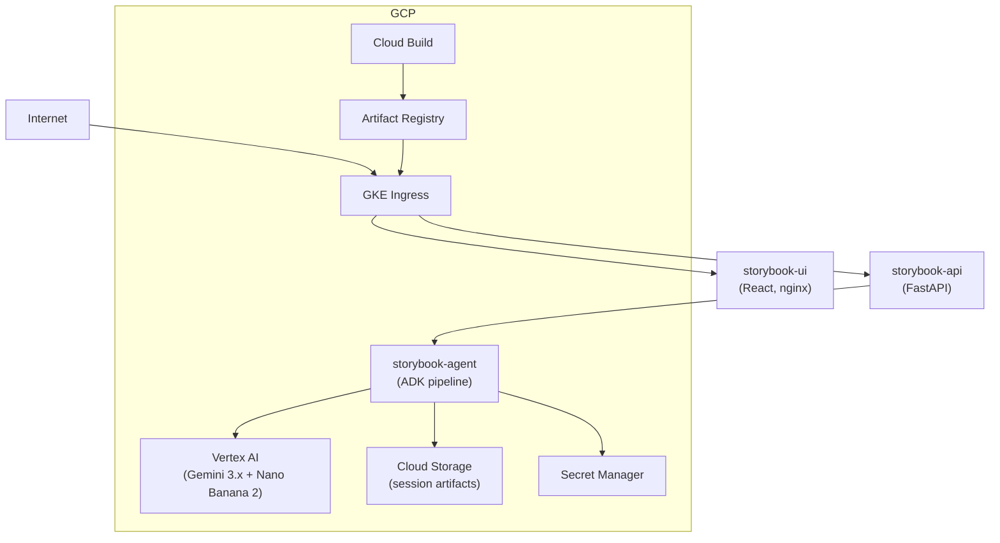
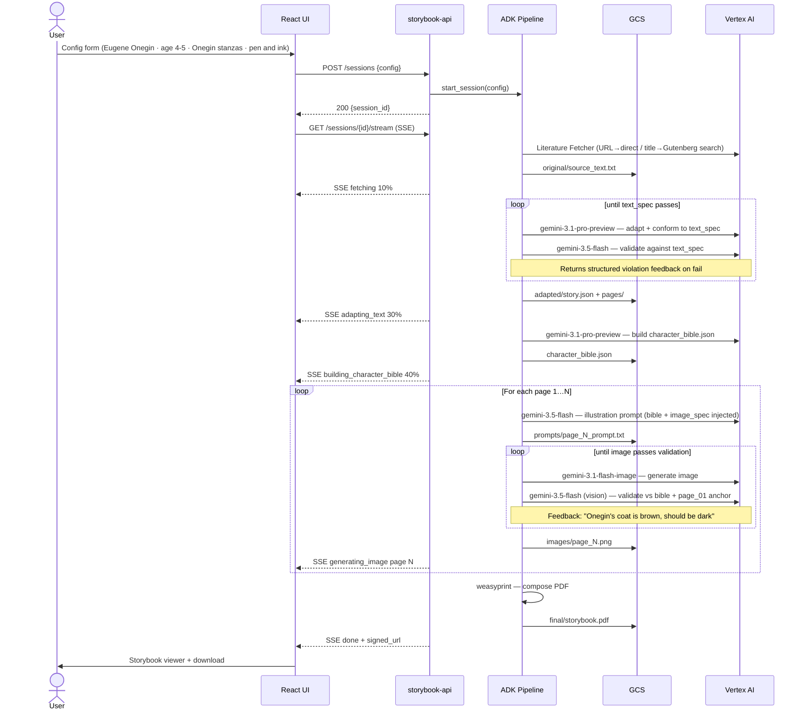

# Storybook Agent — Architecture

A multi-agent pipeline that adapts public-domain literature into illustrated children's storybooks, deployed on Google Cloud.

---

## System Overview

All agents run inside a **single ADK process** (one GKE pod / Cloud Run instance). ADK's `SequentialAgent` and `ParallelAgent` composability handles orchestration in-process — no inter-agent network hops.

The core design principle for custom constraints (poetry forms, art styles, character consistency) is:
> **Free-form natural language specs, injected into prompts, evaluated by the LLM.** No hardcoding of rules. Adding a new constraint requires zero code changes — the user just describes it.



---

## Custom Constraint System

Both text and image constraints follow the same pattern: the user writes a plain-English spec, it gets injected into every relevant agent's prompt, and the LLM evaluates conformance. No special-casing in code.

### Text specifications (`text_spec`)

Passed verbatim to the Story Adapter's system prompt and to the Text Validator's evaluation prompt.

**Example — Onegin Stanzas:**
```
text_spec: "Write in Onegin stanzas. Each stanza is 14 lines of iambic tetrameter
with rhyme scheme ABABCCDDEFFEGG. Each page is exactly one complete stanza.
Do not break stanzas across pages."
```

The Text Validator runs each adapted page through Gemini with a prompt like:
> *"Evaluate whether this text conforms to the following specification: {text_spec}. If it does not, return a JSON object with `pass: false` and a `feedback` field listing each violation with line number and specific reason. Be precise enough that the author can fix it on a retry."*

Violations are returned as structured feedback that loops directly back to the Story Adapter for a targeted retry — not a full rewrite.

### Image specifications (`image_spec`)

Free-form style description passed into every Illustration Prompt and Image Validator.

**Examples:**
```
image_spec: "Pen and ink with cross-hatching. No color fills. High contrast black and white only."
image_spec: "Japanese woodblock print style. Bold outlines, flat areas of color, no gradients."
image_spec: "Loose watercolor wash. Soft edges. Muted earth tones. Impressionistic, not photorealistic."
```

### Character Bible (`character_bible.json`)

Generated once by the **Character Bible Agent** after text adaptation, before any images. Reads the full adapted text + `image_spec` and produces a structured document:

```json
{
  "style": "pen and ink with fine cross-hatching, high contrast, no color",
  "palette": ["#1a1a1a", "#f5f0e8", "#8b6914"],
  "world": "Early 19th century rural Russia and St. Petersburg. Birch forests, candlelit dachas, grand ballrooms.",
  "characters": {
    "Eugene Onegin": "Tall young Russian nobleman, early 20s. Dark hair swept back from forehead. Sharp, angular jaw. Slightly bored, melancholic expression. Fitted dark coat, high white collar, tall leather boots.",
    "Tatiana": "Young Russian woman, late teens. Light brown hair worn in two braids. Wide, expressive dark eyes. Simple country dress with embroidered hem. Often shown near windows or outdoors."
  },
  "recurring_motifs": ["birch trees", "candles", "snow", "letters and quill pens"]
}
```

The bible is injected into:
- Every **Illustration Prompter** call (full character descriptions + style)
- Every **Image Validator** call (used as the consistency checklist)

### Image Validator — multimodal consistency check

The Image Validator calls `gemini-3.5-flash` with:
1. The generated image (current page)
2. Page 1's image (style anchor reference — first page sets the visual standard)
3. The `character_bible.json`
4. The `image_spec`

Evaluation prompt:
> *"Compare the generated image against the character bible and style spec. Check: (1) does each visible character match their physical description? (2) does the overall style match the image_spec? (3) does the style match the reference image? Return `pass: true` or `pass: false` with specific, actionable `feedback` for each violation."*

On failure, the feedback is appended to the original prompt and the Image Generator retries with: *"Previous attempt failed validation: {feedback}. Revised prompt: ..."*

---

## Agent Responsibilities

| Agent | Role | Model |
|---|---|---|
| **Orchestrator** | Runs the full pipeline; holds session context; emits SSE progress events | ADK `SequentialAgent` |
| **Literature Fetcher** | URL provided → fetches directly; title/author only → uses Gutenberg search tool; agent chooses; strips boilerplate | HTTP tool + GCS |
| **Story Adapter** | Rewrites source text for target age group; conforms to `text_spec` if provided | `gemini-3.1-pro-preview` |
| **Text Validator** | Evaluates adapted text against `text_spec` using LLM; returns structured pass/fail with per-violation feedback | `gemini-3.5-flash` |
| **Page Splitter** | Segments adapted story into pages per word-count budget; respects stanza/section boundaries from `text_spec` | deterministic |
| **Character Bible Agent** | Reads full adapted text + `image_spec`; generates `character_bible.json` with character descriptions, style, palette, motifs | `gemini-3.1-pro-preview` |
| **Illustration Prompter** | Writes a page-specific image prompt; injects character bible + image_spec for full consistency | `gemini-3.5-flash` |
| **Image Generator** | Calls Nano Banana 2; prompt includes character bible excerpt + image_spec | `gemini-3.1-flash-image` |
| **Image Validator** | Multimodal: checks generated image against bible, image_spec, and page-1 style anchor; returns structured feedback on retry | `gemini-3.5-flash` (vision) |
| **PDF Compositor** | Combines page text + images into formatted storybook PDF | `weasyprint` |

---

## Session Input Schema

```json
{
  "source": {
    "gutenberg_url": "https://www.gutenberg.org/ebooks/XXXX",
    "title": "Eugene Onegin",
    "author": "Alexander Pushkin"
  },
  "target_age": "4-5",
  "page_count": 12,
  "language": "en",
  "text_spec": "Write in Onegin stanzas. Each stanza is 14 lines of iambic tetrameter with rhyme scheme ABABCCDDEFFEGG. Each page is exactly one complete stanza.",
  "image_spec": "Pen and ink with fine cross-hatching. No color fills. High contrast black and white only. 19th century illustration style.",
  "custom_instructions": "Focus on the Tatiana storyline. Emphasize wonder and nature."
}
```

All spec fields are optional. Defaults: no `text_spec` (prose), no `image_spec` (agent chooses style appropriate to the work).

**Age group → pipeline parameters:**

| Age Group | Max words/page | Sentence length | Gemini reading level target |
|---|---|---|---|
| 4–5 | 20 | 5–7 words | Pre-K / Primer |
| 6–8 | 50 | 8–12 words | Grade 1–2 |
| 9–12 | 100 | 12–20 words | Grade 3–5 |

---

## Frontend Architecture

A separate React service with a config form that exposes `text_spec` and `image_spec` as plain text areas — no dropdowns or preset lists, just free-form input.



**Tech stack:**

| Concern | Choice |
|---|---|
| Framework | React 19 + TypeScript |
| Build | Vite |
| Styling | Tailwind CSS |
| Real-time | SSE (one-way server push, simpler than WebSockets) |
| Page flip | `react-pageflip` |
| State | Zustand |
| HTTP | `@tanstack/react-query` |

**SSE event shapes:**
```json
{ "event": "progress", "stage": "building_character_bible", "pct": 35 }
{ "event": "progress", "stage": "generating_image", "page": 3, "of": 12, "pct": 58 }
{ "event": "progress", "stage": "image_retry", "page": 3, "attempt": 2, "reason": "Tatiana's hair color inconsistent with character bible" }
{ "event": "done", "signed_url": "https://storage.googleapis.com/...", "session_id": "abc123" }
{ "event": "error", "stage": "text_validation", "message": "Retry limit reached. Stanza 4 does not scan as iambic tetrameter." }
```

---

## Deployment Topology

Three GKE services:
- `storybook-ui` — React app served by nginx
- `storybook-api` — FastAPI, SSE stream management
- `storybook-agent` — ADK pipeline, single pod (personal project)



---

## GCS Artifact Layout

```
gs://storybook-artifacts-{project_id}/
└── sessions/
    └── {session_id}/
        ├── config.json
        ├── original/
        │   └── source_text.txt
        ├── adapted/
        │   └── story.json
        ├── character_bible.json          ← generated once, used by all image agents
        ├── pages/
        │   ├── page_01.txt … page_N.txt
        ├── prompts/
        │   ├── page_01_prompt.txt … page_N_prompt.txt
        ├── images/
        │   ├── page_01.png … page_N.png  ← page_01 also serves as style anchor
        └── final/
            └── storybook.pdf
```

---

## Session Lifecycle



---

## Resolved Decisions

| Decision | Choice |
|---|---|
| Pod lifecycle | Single pod — personal project, one user |
| Gutenberg source | Agent decides: URL → direct fetch; title/author → Gutenberg search tool |
| Auth | Anonymous — no login required |
| Image model | `gemini-3.1-flash-image` (Nano Banana 2); `gemini-3-pro-image` (Nano Banana Pro) for higher fidelity |
| Text model | `gemini-3.1-pro-preview` for adaptation + bible; `gemini-3.5-flash` for everything else |
| Custom constraints | Free-form `text_spec` + `image_spec` fields; LLM evaluates — no hardcoded rules |
| Image consistency | Character Bible Agent (runs once) + page-1 style anchor in every validation call |
| Art style input | Free-form `image_spec` string — no preset dropdown |

## Open Questions

- [ ] **Retry limits**: How many text/image validation retries before surfacing an error to the user? (Suggest: 3 for text, 2 for images)
